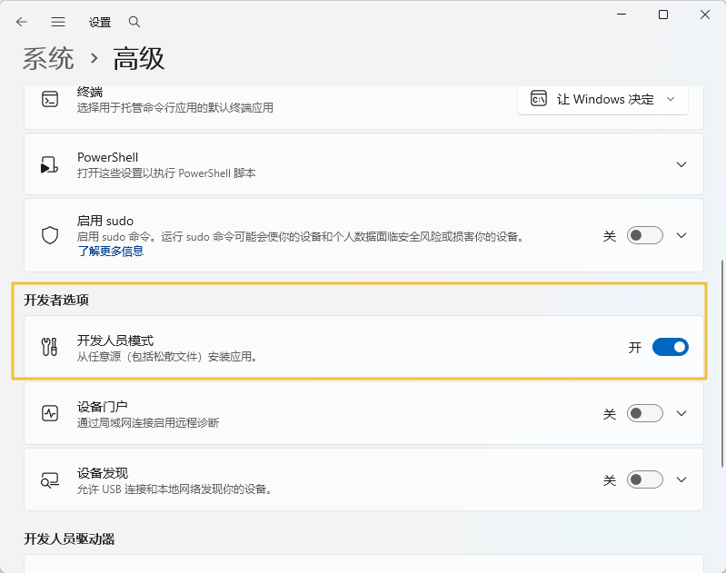
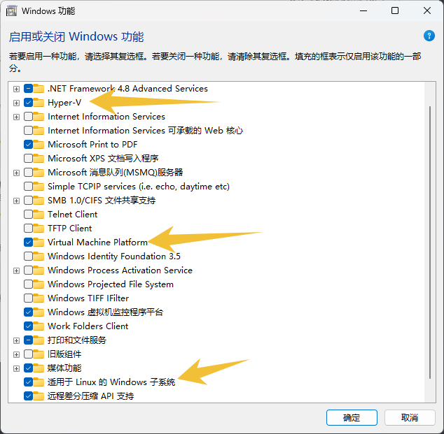
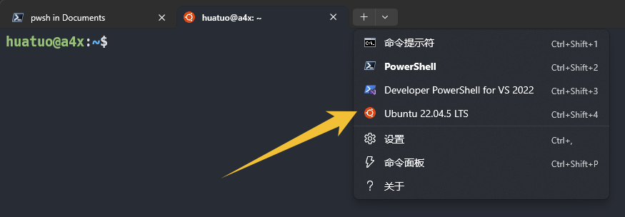

# WSL安装和基本配置

by 华佗

------

[TOC]

------

## 安装

### 开发人员模式

- `Win+i`搜索`开发者`——进入`高级系统设置`——打开`开发人员模式`
- 

### 开启Windows虚拟化

- 打开控制面板——`程序`——`启用或关闭Windows功能`
- 
- 如果没有`Hyper-V`的选项，使用**管理员权限**，执行`./hyper-v/opoen-hyper-v.bat`脚本
- 系统会要求重启

### 升级WSL2

- **管理员权限**打开CMD（我使用PowerShell没有wsl命令），执行`wsl -l -v`，可以看到输出，就是正常
- 继续执行`wsl --update`，时间挺久，安装的东西不少，可能会提示重启电脑
- 重启后，PowerShell中就可以使用wsl命令了

### 安装Ubuntu

- 可是使用命令`wsl --install -d Ubuntu-22.04`，使用命令`wsl -l -o`可查看线上可用的虚拟环境

- 也可以在**微软商店**中搜索`ubuntu`，然后选择安装

- 安装完成后，执行`wsl -l -v`，可看到已安装的环境，此时需要**VERSION**为**2**

- 在`Windows Terminal`中看到如下内容，说明安装成功

  

- 第一次启动需要配置**UserName**和**Password**

## Setup环境

### 基础工具

```shell
# On Windows WSL2
# Base: Ubuntu22.04LST

# 更换软件源
sudo cp /etc/apt/sources.list /etc/apt/sources.list.bak
sudo vim /etc/apt/sources.list
"
deb http://mirrors.aliyun.com/ubuntu/ trusty main restricted universe multiverse
deb http://mirrors.aliyun.com/ubuntu/ trusty-security main restricted universe multiverse
deb http://mirrors.aliyun.com/ubuntu/ trusty-updates main restricted universe multiverse
deb http://mirrors.aliyun.com/ubuntu/ trusty-proposed main restricted universe multiverse
deb http://mirrors.aliyun.com/ubuntu/ trusty-backports main restricted universe multiverse
deb-src http://mirrors.aliyun.com/ubuntu/ trusty main restricted universe multiverse
deb-src http://mirrors.aliyun.com/ubuntu/ trusty-security main restricted universe multiverse
deb-src http://mirrors.aliyun.com/ubuntu/ trusty-updates main restricted universe multiverse
deb-src http://mirrors.aliyun.com/ubuntu/ trusty-proposed main restricted universe multiverse
deb-src http://mirrors.aliyun.com/ubuntu/ trusty-backports main restricted universe multiverse
"

# 添加第一个公钥（40976EAF437D05B5）
sudo apt-key adv --keyserver hkp://keyserver.ubuntu.com:80 --recv-keys 40976EAF437D05B5
sudo apt-key export 40976EAF437D05B5 | sudo gpg --dearmour -o /etc/apt/trusted.gpg.d/aliyun-ubuntu.gpg

# 添加第二个公钥（3B4FE6ACC0B21F32）
sudo apt-key adv --keyserver hkp://keyserver.ubuntu.com:80 --recv-keys 3B4FE6ACC0B21F32

sudo apt-get update
sudo vim /etc/apt/sources.list
# sudo apt install python3.12 python3.12-venv python3.10-venv -y
sudo apt install python3-pip -y
sudo apt install python3.12 -y
sudo apt install python3.12-venv -y
sudo apt install python3.10-venv -y
cd /usr/bin; sudo ln -s python3.12 python; cd -

# 解决Depends: libc6 (= 2.19-0ubuntu6.15) but 2.35-0ubuntu3.8 is to be installed
sudo apt -f install
# 备份当前源配置
sudo cp /etc/apt/sources.list /etc/apt/sources.list.bak
# 替换为 Ubuntu 22.04 官方源 （在后面加上这些好像也行）
echo "deb http://archive.ubuntu.com/ubuntu/ jammy main restricted universe multiverse
deb http://archive.ubuntu.com/ubuntu/ jammy-updates main restricted universe multiverse
deb http://archive.ubuntu.com/ubuntu/ jammy-backports main restricted universe multiverse
deb http://security.ubuntu.com/ubuntu/ jammy-security main restricted universe multiverse" | sudo tee /etc/apt/sources.list
# 清除所有旧包缓存
sudo apt clean
sudo rm -rf /var/lib/apt/lists/*
# 重新生成包列表（强制从新源拉取）
sudo apt update
# 安装或升级 libapt-pkg6.0（apt 的核心依赖）
sudo apt install --reinstall libapt-pkg6.0
# 处理 ncurses 冲突（Ubuntu 22.04 通常用 libtinfo6，移除旧版本 libtinfo5）
sudo apt remove --purge libtinfo5
sudo apt install ncurses-base libtinfo6
# 重新安装 apt（确保版本正确）
sudo apt install --reinstall apt
sudo apt-get install aptitude -y
sudo apt install build-essential -y
sudo apt install libsystemd-dev -y
sudo aptitude install lib32stdc++6
sudo apt install clangd -y
sudo apt-get install ripgrep -y  # rgrep -V
sudo apt install fd-find -y
sudo apt-get install neofetch -y
# 还原源配置
sudo cp /etc/apt/sources.list.bak /etc/apt/sources.list
sudo apt-get update

sudo apt install curl -y
sudo apt install net-tools -y
sudo apt install lcov -y
sudo apt-get install bear -y
sudo apt-get install tofrodos -y  # fromdos/todos
sudo apt-get install vim -y
sudo apt install xclip -y
sudo apt-get install ninja-build -y
sudo apt install cmake -y  # cmake --version

# nodejs
curl -fsSL https://deb.nodesource.com/setup_current.x | sudo -E bash -
sudo aptitude install nodejs
sudo npm install n -g
sudo n stable
sudo npm install -g yarn

# zsh
sudo apt-get install -y zsh
sh -c "$(curl -fsSL https://raw.github.com/ohmyzsh/ohmyzsh/master/tools/install.sh)"
sudo apt-get install powerline -y
git clone https://github.com/zsh-users/zsh-autosuggestions $ZSH_CUSTOM/plugins/zsh-autosuggestions
git clone https://github.com/zsh-users/zsh-syntax-highlighting.git $ZSH_CUSTOM/plugins/zsh-syntax-highlighting
git clone --depth=1 https://github.com/romkatv/powerlevel10k.git ${ZSH_CUSTOM:-$HOME/.oh-my-zsh/custom}/themes/powerlevel10k
# 修改~/.zshrc
# ZSH_THEME="powerlevel10k/powerlevel10k"
# plugins=(
#     git
#     z
#     zsh-syntax-highlighting
#     zsh-autosuggestions)
#
#重启终端配置powerlevel10k
echo "
export PATH=\$PATH:\$HOME/.local/bin/
" >> ~/.zshrc

#ssh
sudo apt-get install openssh-server -y
ssh-keygen  # ssh-keygen -t ed25519
touch ~/.ssh/authorized_keys

# fzf
sudo apt-get install fzf
# vim ~/.zshrc
"
# FZF
[ -f ~/.fzf.zsh ] && source ~/.fzf.zsh
export FZF_DEFAULT_OPTS='--height 90% --layout=reverse --border --preview "[[ $(file --mime {}) =~ binary ]] && echo {} is a binary file || (ccat --color=always {} || highlight -O ansi -l {} || cat {}) 2> /dev/null | head -500"'
export FZF_COMPLETION_TRIGGER='\'
export FZF_PREVIEW_COMMAND='[[ $(file --mime {}) =~ binary ]] && echo {} is a binary file || (ccat --color=always {} || highlight -O ansi -l {} || cat {}) 2> /dev/null | head -500'
"

# ranger
sudo apt-get install ranger
ranger --copy-config=all
git clone https://github.com/alexanderjeurissen/ranger_devicons ~/.config/ranger/plugins/ranger_devicons
echo "default_linemode devicons" >> $HOME/.config/ranger/rc.conf
echo "
# ranger
alias ra=\"ranger\"
export EDITOR='vim'
" >> ~/.zshrc

# tmux
sudo apt install tmux -y
git clone https://github.com/KyleDeng/tmux.conf
cp ./tmux.conf/tmux.conf ~/.tmux.conf

# ctags
sudo apt-get install autoconf -y
sudo apt-get install universal-ctags  # sudo apt-get install ctags -y
# 设置全局git忽略
git config --global core.excludesfile ~/.gitignore_global
touch ~/.gitignore_global
echo ".tags" >> ~/.gitignore_global

# thefuck
pip3 install https://github.com/nvbn/thefuck/archive/master.zip
echo "
# thefuck
eval $(thefuck --alias)
" >> ~/.zshrc

# lazygit
LAZYGIT_VERSION=$(curl -s "https://api.github.com/repos/jesseduffield/lazygit/releases/latest" | \grep -Po '"tag_name": *"v\K[^"]*')
curl -Lo lazygit.tar.gz "https://github.com/jesseduffield/lazygit/releases/download/v${LAZYGIT_VERSION}/lazygit_${LAZYGIT_VERSION}_Linux_x86_64.tar.gz"
tar xf lazygit.tar.gz lazygit
sudo install lazygit -D -t /usr/local/bin/
echo "
# lazygit
alias lg=\"lazygit\"
" >> ~/.zshrc

# neovim lazyvim
# sudo add-apt-repository ppa:neovim-ppa/unstable
# sudo apt-get update
sudo apt-get install neovim -y
git clone https://github.com/LazyVim/starter ~/.config/nvim
# 打开一次nvim 等待插件安装完成
rm -rf ~/.config/nvim
git clone https://github.com/KyleDeng/nvim.git ~/.config/nvim  # git@github.com:KyleDeng/nvim.git
# 按照readme配置
cd ~/.local/share/nvim/lazy/coc.nvim
yarn install
yarn build

```

- 如果启动nvim有关于alpha-nvim的报错

  > 可能需要修改文件`~/.local/share/nvim/lazy/LazyVim/lua/lazyvim/plugins/extras/editor/snacks_picker.lua`，
  >
  > 找到`alpha-nvim`（大概184行），把opts的赋值删除

- 关于wsl中`tree-sitter`的报错

  > 执行`which tree-sitter`，结果是`/mnt`开头的，说明使用了Windows环境的工具，
  >
  > 在Ubuntu中执行`sudo npm install -g tree-sitter-cli`，重启终端，
  >
  > 再执行`which tree-sitter`，确定是`/usr`开头，再打开nvim，正常

- `thefuck`运行慢的问题

  > 原因是wsl中使用了Windows的环境变量，验证：`echo $PATH`，能看到
  >
  > 修改文件`sudo vim /etc/wsl.conf`，加上如下内容
  >
  > ```shell
  > [interop]
  > appendWindowsPath = false
  > ```
  >
  > 在Windows中关闭wsl，`wsl --shutdown`，重新打开

### git配置

```shell
git config --global user.name "姓名"  # 配置用户名，必须
git config --global user.email "邮箱"  # 配置git登陆账号，必须
git config --global core.editor vim  # 配置git编辑器
git config --global core.autocrlf false  # 禁止回车换行不匹配，导致无法提交问题
git config --global color.ui auto  # git命令返回结果会有颜色
git config --global credential.helper store  # 保存登陆密码
git config --global core.quotepath false  # 禁用 Git 对路径中非 ASCII 字符（如中文、日文等）的自动转义
git config --global http.postBuffer 524288000  # http缓冲区大小

# git config --add core.filemode false //忽略文件权限的比较
# git config --global commit.template /path/to/t.template //增加个人提交模块
```

`vim ~/.zshrc`

```shell
# git
alias gitperson='git config --global user.name "KyleDeng"; git config --global user.email "dlkxiaok@163.com"'
alias gitshow='git config --global user.name ""; git config --global user.email ""'

```


### 配置UTF-8

```shell
locale
sudo vim /etc/locale.gen
# 找到“en_US.UTF-8 UTF-8” “zh_CN.UTF-8 UTF-8”并取消注释
sudo locale-gen  # 生成 locale
sudo update-locale LANG=en_US.UTF-8  # 或 zh_CN.UTF-8
```


## WSL的迁移备份

### 从C盘迁移

```shell
# 关闭wsl
wsl --shutdown

# 关闭指定环境
wsl --terminate Ubuntu-22.04

# 导出
wsl --export Ubuntu-22.04 D:\WSL\WSL-U22.tar

# 注销（删除）原有虚拟机
wsl --unregister Ubuntu-22.04

# 导入到D:\WSL\U22（必须存在此目录）
wsl --import Ubuntu-22.04 D:\WSL\U22 D:\WSL\WSL-U22.tar --version 2

# 使用原有用户登录
ubuntu2204 config --default-user huatuo
```

### 新电脑使用

- 先正确安装一次wsl
- 删除新的虚拟机
- 导入旧电脑上面的`tar包`


